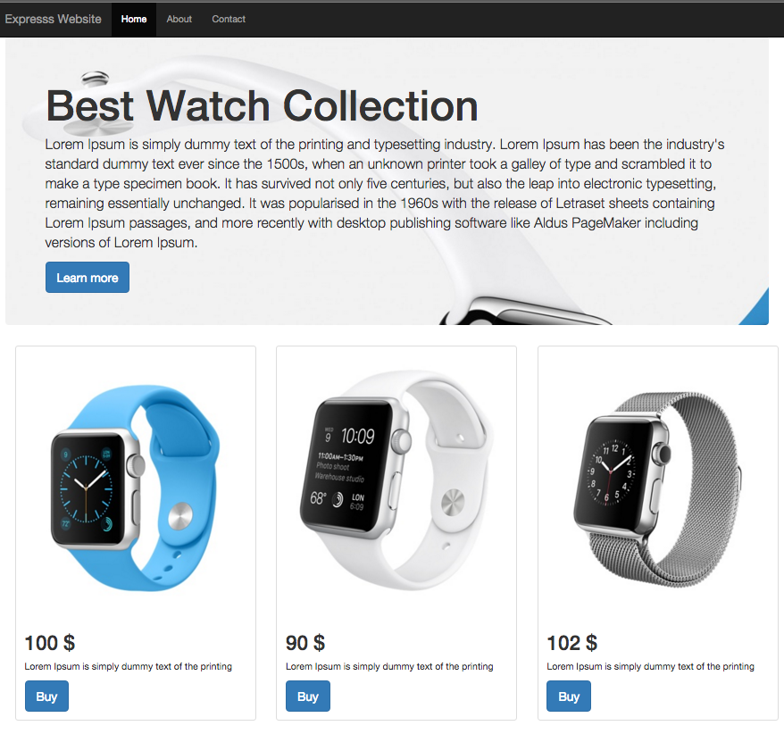

# Express Web site
To  run this sample  in your computer follow the instructions Bellow



##Dependencies
* NPM

##Usage
```
git clone https://github.com/bachiri/node.js-Samples.git
npm install
nmp start
```
##Description
This Express application is capable of 
* Render Html files 
* Navigate between pages 
* Send E-mail using nodeMailer


##More Detail

First Install express with the following command :
```
npm install -g express 
npm install -g express-generator 
```
you can now clone the app and run it 

to generate your application 
for exemple you tape express and the name of your application 
```
express  Express_sample
```
after creating your app now install your app  
```
nmp install 
```
